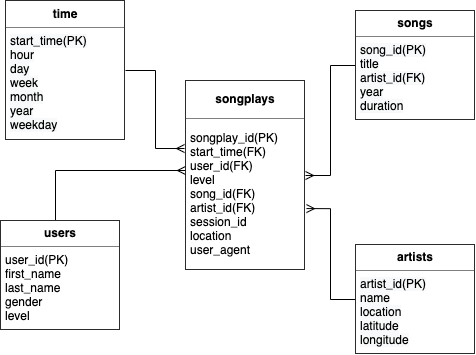

# Project Summary
A startup called Sparkify needs to create this database with the goal of being able to analyze data about songs and user behavior.

## Schema for Song Play Analysis
Using the song and log datasets, you'll need to create a star schema optimized for queries on song play analysis. This includes the following tables.

### Fact Table
1. songplays - records in log data associated with song plays i.e. records with page NextSong
* songplay_id, start_time, user_id, level, song_id, artist_id, session_id, location, user_agent

### Dimension Tables
1. users - users in the app
    * user_id, first_name, last_name, gender, level
2. songs - songs in music database
    * song_id, title, artist_id, year, duration
3. artists - artists in music database
    * artist_id, name, location, latitude, longitude
4. time - timestamps of records in songplays broken down into specific units
    * start_time, hour, day, week, month, year, weekday

The diagram of the star schema is shown below.


## How To run the script

1. you run the terminal, and run the following command.

```python
$ python create_tables.py
```

2. Run When you run `etl.py`, etl processing is performed.

```python
$ python etl.py
```

3. Run `test.ipynb` to confirm your records were successfully inserted into each table.

## Analysis
The following is an example of SQL for analysis.
Execute the following SQL to find out how many times a user has played a song in a month.

```sql
%sql SELECT user_id, month, year, count(*) FROM songplays \
JOIN time ON songplays.start_time = time.start_time \
GROUP BY user_id, month, year;
```
